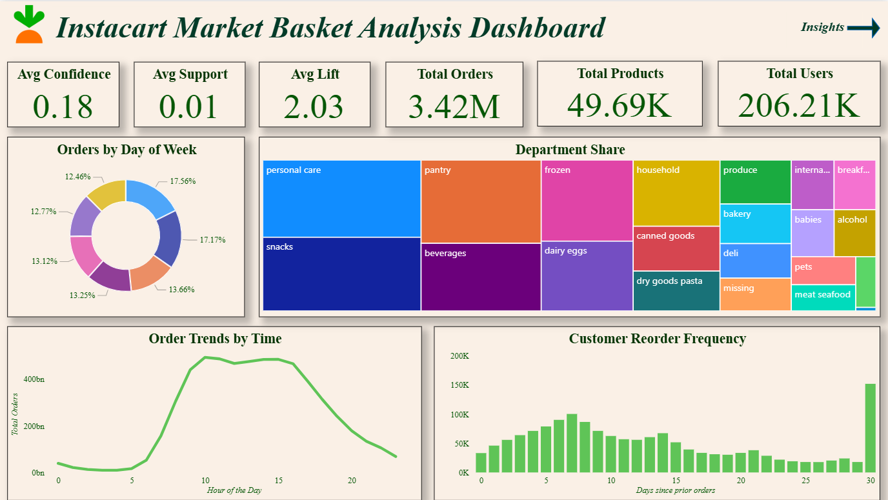
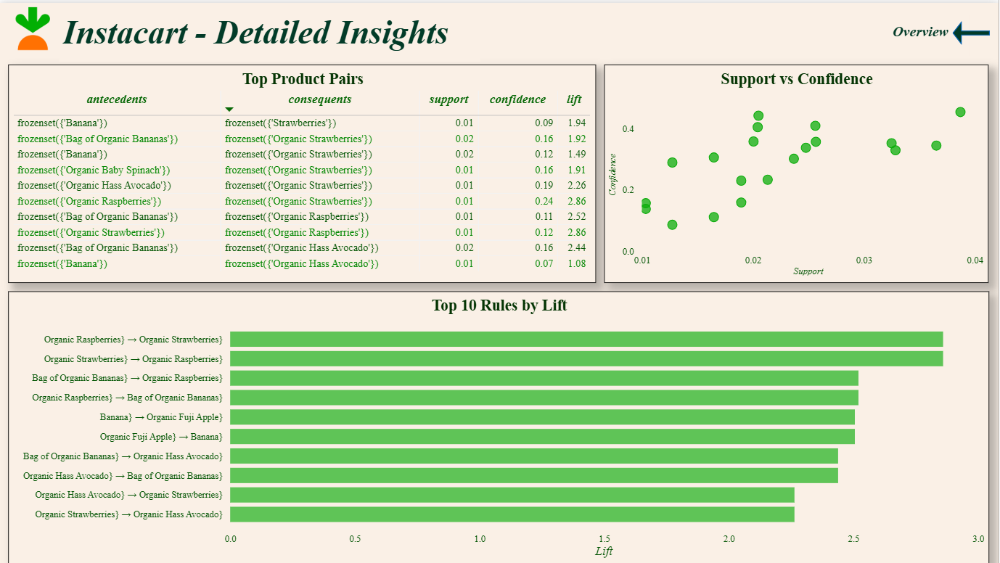
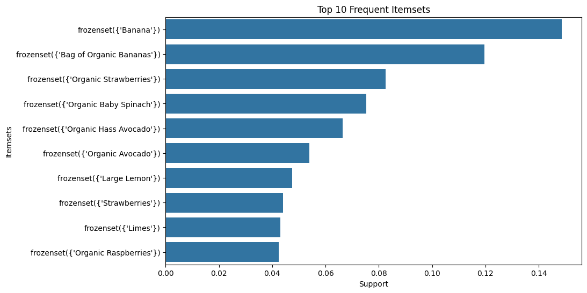
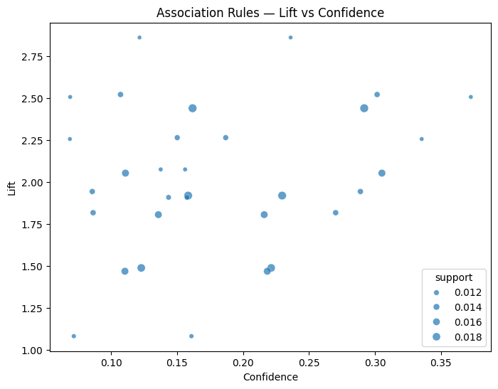
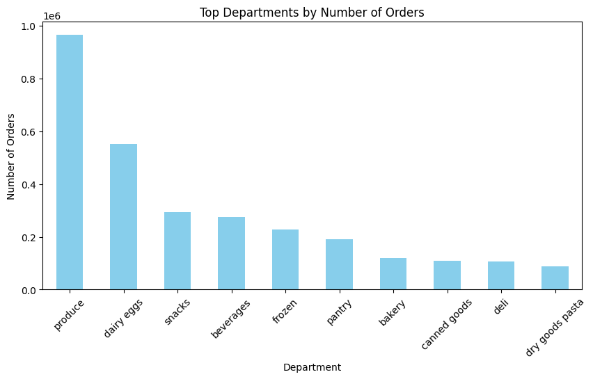

# 🛒 Instacart Market Basket Analysis

This project analyzes ***Instacart Online Grocery data*** to find which products are frequently bought together using the ***Apriori Algorithm***. It also includes a ***Power BI Dashboard*** to visualize product associations, lift, and cross-selling insights.

📊 Objectives
- Find frequently bought product pairs  
- Generate association rules (support, confidence, lift)  
- Create a Power BI dashboard for visual insights  
- Give business recommendations for cross-selling

🧰 Tools Used
- **Python (Google Colab)** — Data Cleaning & Market Basket Analysis  
- **Power BI** — Dashboard Visualization  
- **Kaggle Dataset** — Instacart Online Grocery Basket Analysis

📈 Key Insights
-	Produce & Dairy are the most purchased departments
-	Organic items (fruits and greens) dominate frequent baskets
-	Customers mostly shop between 9 AM – 12 PM
-	High lift values show strong cross-selling potential

🧩 Files You’ll Find Here
- `InstaCart_Online_Grocery_Basket_Analysis.ipynb` - Google Colab notebook 
- `Instacart_Market_Basket_Analysis.pbix` - View Power BI Dashboard on Google Drive(https://drive.google.com/file/d/1sy5r6QQlyv9Uw6l1PDICDigLvIAQuoJH/view?usp=sharing)
- `Instacart_Market_Basket_Dashboard.pdf` - Dashboard PDF preview included for both pages.
- `association_rules.csv` - Output file of Apriori rules 
- `report.pdf` - Project report summary 
- `images/` - Contains dashboard & chart screenshots 

👩‍💻 Author
***Krupa Gajra*** 

Data Analyst | Python | Power BI  
[LinkedIn Profile](https://www.linkedin.com/in/krupagajra/)
📅 Year: 2025  

---

✨ *“Turning grocery data into smarter product insights.”* ✨

---

## 📸 Dashboard Previews

### 🧭 Overview Dashboard : 
This page shows overall KPIs, top departments, and customer behavior trends.

### 💡 Insights Dashboard : 
This page explores deeper product associations — support, confidence, and lift.

---

## 📊 Key Visuals

**Top 10 Frequent Itemsets** : 
Shows which product combinations are most common in orders.

**Association Rules — Lift vs Confidence** : 
Visualizes the strength and frequency of product relationships.

**Top Departments by Orders** : 
Highlights the most popular shopping departments.

